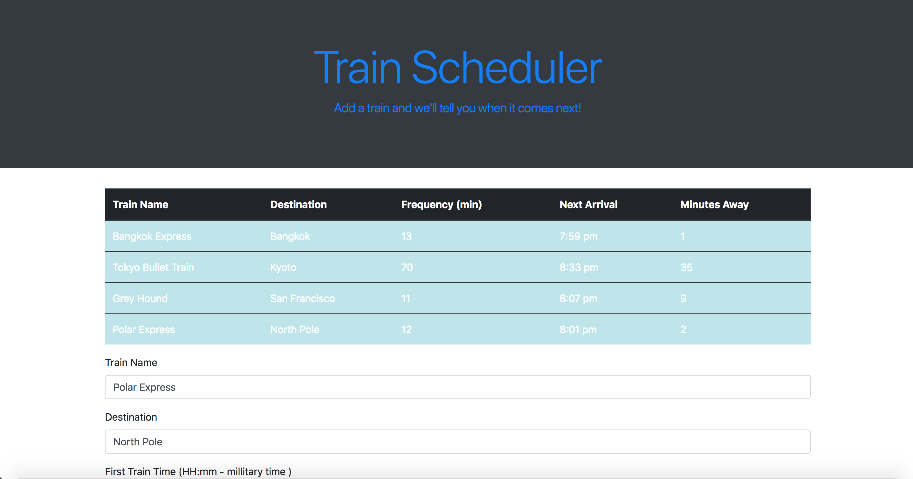

# Train-Scheduler

Welcome to Grand Central Station! Except here, you decide when the first train comes, how frequently it comes and using our state of the art algorithms, we'll tell you at what time the next train comes and how many more minutes until then!

  

This page implements moment.js to store the current time, store the times of trains, and calculate when the next train will arrive.

If you'd like to the leave the page and come back later, don't worry! We save the information in a database via firebase so that you'll never have to worry about losing your itinerary.

## Languages and Libraries Used
HTML, CSS, Javascript, JQUERY, Firebase, Moment.js
